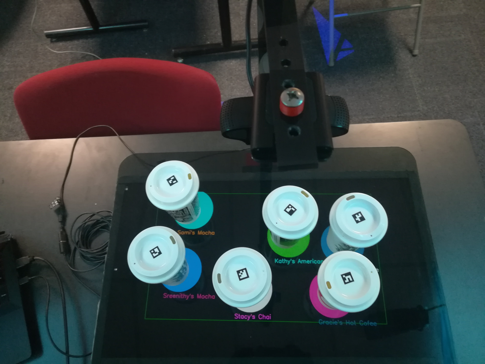

# Coffee Cup Identification

A program automates the process of coffee ordering and digitalizes the pick up counter by dynamically tracking the cups on the hand off plane and displaying the details of the order.

## Getting Started

These instructions will get you a copy of the project up and running on your local machine for development and testing purposes.

### Dependencies

Python 2.7  
*See [Installing python](https://www.python.org/download/releases/2.7/) for instructions on how to install python.*  
openCV 3.4
*See [Installing openCV3.4](http://www.python36.com/how-to-install-opencv340-on-ubuntu1604/) for instructions on how to install openCV3.4.*

## How to run

Open a terminal or console. Change the operating directory to where the files are located and type in`python read_aruco_order.py` This would run the program for placing the order and tagging the cups.

Open another terminal or console. Change the operating directory to where the files are located and type in`python read_aruco_table.py` This would run the program for identifying the cups on the counter top.

## Program structure

The program is divided into two main codes the `read_aruco_order.py` and  `read_aruco_table.py`.

The `read_aruco_order.py` is executed at the cashier computer this program detects an Aruco marker using computer vision and would check the SQl table is this marker has been used for any other order that is on process, if not the current order is assigned to this cup and the SQL table is updated.

The cup is tracked through the process of making the drink aiding the barista in the kitchen with the details of the drink. The `read_aruco_table.py` code first calibrates the camera for the orientation of the counter top and the height of the cups by obtaining a homography matrix. Once this cup reaches the pickup counter an over head camera detects the cups using the Aruco marker. The location of the cup on the world frame is computed using the homography matrix, a perspective transformation is performed to display a circle below the cup and the details of the order around the circle.

The Calibration process is a human assisted process where the system asks the human to place a special calibration cup in a defined region on the counter top. This cup aids in estimating the height of the cups to compute the homography matrix which is saved as a numpy array.

## Authors

* **Rakshith Subramanyam** -  [github](https://github.com/Rakshith-2905)

## License

None
